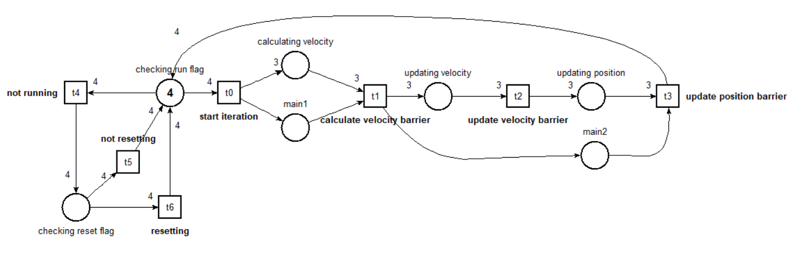
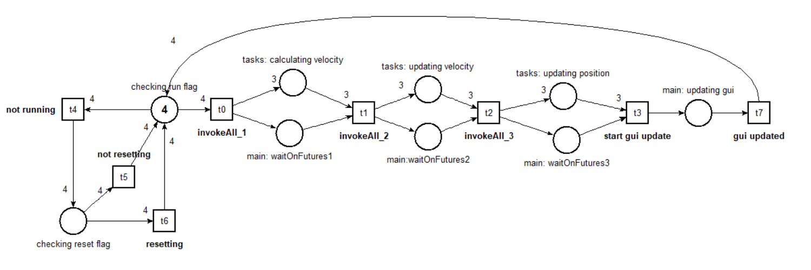
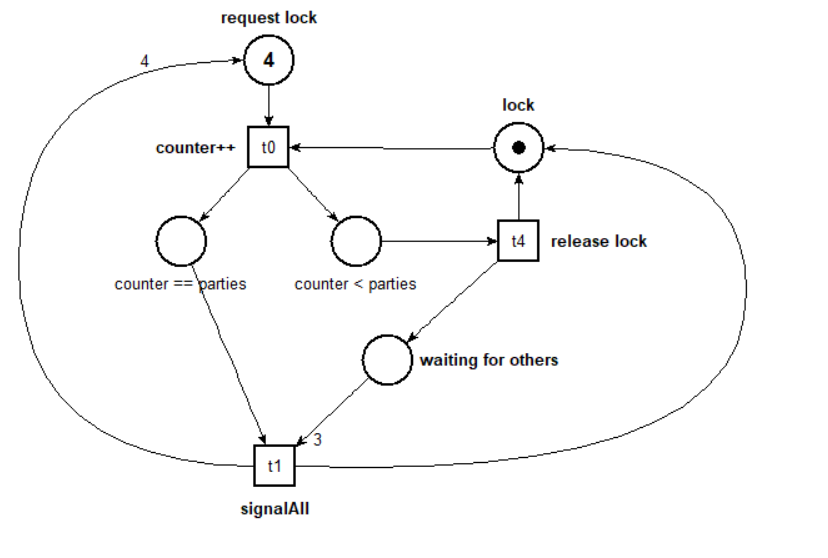
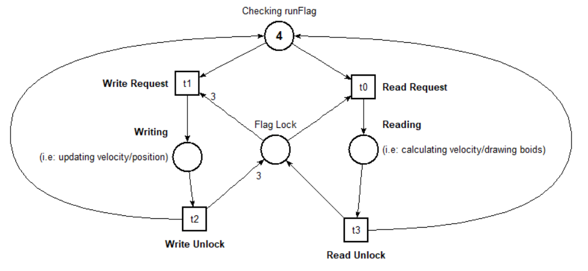
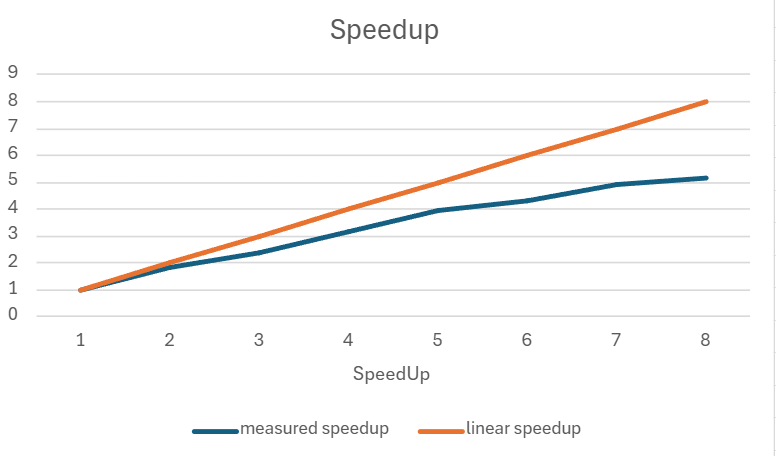
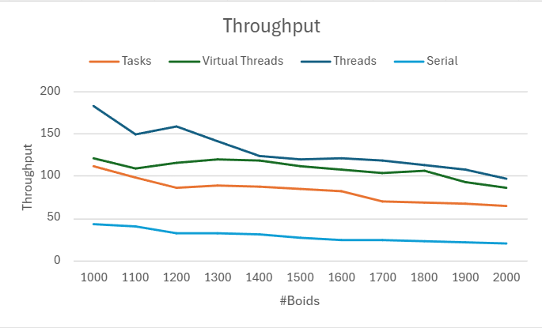

# Report Assignment 1
Concurrent and Distributed Programming  
_Muhamad Huseyn Salman_

## 1. Analysis
In parallelizing the code, the main problem to be faced was the management of parallel readings and writings of each boid from a shared list. 
Each boid to update its speed needs to refer to neighboring boids, consequently it must read their state. Without any kind of synchronization,
there is the risk that a worker goes to read the speed of a neighboring boid while another worker is modifying it.
It is also necessary that the workers synchronize not only with each other but also with the View, giving it time to draw the boids before being able to
update them at the next instant of time.

 

## 2. Design
### 2.1 State Management
Each version is inclined to different parallelization techniques, but the synchronization is rather similar. An `MVC` architecture was adopted
in which the state of execution of the simulation is encapsulated into the
`Flag` monitor objects. When one of the buttons is pressed, the view reports the change of state to the controller through `notify` methods, which
Update the status of the corresponding flag (to the buttons of suspend/resume
and Resets have been assigned separate flags).
Flags are used at each iteration by workers to control whether to
continue execution or not, and by main to control whether to reset the
simulation. Specifically, the different buttons have this effect:
* `Suspend/Resume`: in the suspend state workers cannot start a  new iteration, the reset button is enabled and main actively checks
if it is pressed. 
* `Reset`: can be pressed only when the simulation is suspended and terminates  
workers, while main creates a list of boids updated to the new size for new workers

 

### 2.2 Concurrency Management
In all versions, to avoid concurrent readings and writings, the two operations have been separated into distinct phases. 
Before starting a new phase, all workers must have completed the previous phase. 
For example, initially all boids read the information needed to calculate their own speed, and only then do they all proceed to update the field

For each boid the phases are:
1. Reading and calculating the velocity
2. Writing the new velocity
3. Calculating and writing the new position
4. Reading and updating the GUI

The GUI update only happens at a stage where the boids are not being modified, so the `SwingUtils.invokeAndWait()` method from main was used to update the GUI synchronously, to avoid that workers can modify the boids while the GUI is still drawing them.
 

### 2.3 Versions Details
The differences between the individual versions are highlighted below, considering that what has been said so far is valid for all versions since a similar approach has been adopted.

**Version 1 - Platform Threads** In this version `N`
threads have been created (N = number of available cores), each of which deals with a
subset of boids. Different cyclic barriers have been used to keep
the threads synchronized in the various phases of calculation/reading and writing of the boids.

The barriers used are:
1. Barrier for calculating the speed (`counter = N+1`)
2. Barrier for updating the speed (`counter = N`)
3. Barrier for updating the position (`counter = N+1`)

To break the first and last barriers, the main must also wait,
in addition to the N workers. This is because the main is responsible for updating the graphics, so by breaking the third barrier it knows it can update the GUI since the threads have finished writing the updated positions.
On the other hand, the first barrier cannot be broken until the main has finished
updating the GUI, otherwise the threads would modify the boid fields
while they are being drawn.

`JPF Model Checking`: A simplified model of the code was created,
removing the GUI, simplifying the speed calculation and removing the use
of random in the initialization of the boids. No critical races were detected
in the use of barriers. However, the interaction with
the View was not modeled both for lack of time and because the execution time and the
amount of memory required by JPF to execute grows exponentially
with respect to the number of instructions in the code.

**Version 2 - Executor Service** In this version, different
`Task` classes have been created for the various phases of the simulation. In each phase, a
task is created for each boid. These are invoked in parallel via
an `ExecutorService` of type `FixedThreadPool`. The completion of each
task is waited for on the corresponding Future object and when all the
tasks of a phase are finished, you can move on to the next phase. Once the
phases are finished, the GUI is updated and the cycle is repeated

Types of Tasks created:
1. Task for calculating the velocity
2. Task for updating the velocity
3. Task for updating the position

Tasks are interrupted and recreated only when the reset button is pressed, otherwise they are invoked at each iteration. When the suspend button is pressed,
main no longer executes the code in which the tasks are invoked. When the reset button is pressed, new tasks are created based on the new size
of the boid list.

**Version 3: Virtual Threads** Since virtual threads are very lightweight and allow us to overcome the limit of physical threads of the system, in
this version a virtual thread has been created for each boid, which takes care of the corresponding calculations and updates. 
The synchronization and the behavior of the system at the press of a button are analogous to the case of  physical threads.

 

### 2.4 Monitor Implementations
As requested, the synchronization mechanisms used has been implemented from scratch, using only `Lock` and `Conditions`.

`MyCyclicBarrier`: using a lock a critical section has been built
in the await method that blocks the thread in case the number of threads already waiting is not enough to break the barrier. 
The thread that breaks the barrier first resets it and then wakes up all the threads waiting. 
The condition on the while uses a `generation` variable and not the `counter`, otherwise there would be the risk that a thread checks the condition on the counter when it has already been reset.

`MyReadWriteLock`: allows parallel readings but serializes writings.
A writing can only occur when there are no readings in progress,
otherwise a writing request is signaled that prevents new
readers from entering the critical section, thus avoiding the starvation of the writer. This class is used internally by the Flag monitor class.

 

### 2.5 Thread Join Issue
In version 1 and 3, a problem was found in the termination of threads. Unlike Tasks in the case of Executors, which terminate at each
iteration and are invoked again in the next one, threads were designed to terminate only when the reset button is pressed.

To terminate threads, initially only the Flag associated with the reset button was used. 
However, this is not sufficient, because the following scenario can occur:
1. Some threads start a new iteration (`runFlag = true`)
2. The simulation is paused (`runFlag = false`)
3. The remaining threads cannot start a new iteration (`runFlag = false`)
4. The threads from point 1 are blocked on the first barrier that cannot be reached by the remaining threads

This scenario is not a problem if the simulation is restarted.
But if you want to reset it, the threads that have already reached
the barrier will never be able to terminate (joining workers would cause a
deadlock). To avoid this scenario, a `break()` method has been added to the
barrier implementation that allows the main to break the barrier
on command and wake up all the waiting threads. Once woken up, the threads
overcome all the barriers because they are already broken and notice that the simulation
is paused (`runFlag = false`) and that the reset button has been pressed, so they terminate.

 

## 3. Behaviour
The following Petri Nets represent the behavior of the system at different levels of abstraction. 
The places represent the states that the workers go through, while the tokens represent the workers. 
These nets consider the case of 3 workers and the main, therefore with 4 total tokens.

### 3.1 High-Level Behaviour
This first network describes the general iterative behavior of the system,
therefore the various states it passes through during a normal iteration, including
the synchronization points (barriers) and the control on the two flags before starting a new iteration.
 

 

The system behavior is very similar also in the version based on Executors and Tasks.
 

  
### 3.2 MyCyclicBarrier Behaviour
The second network represents the critical section inside the Barrier. Barriers are used only in version 1 and 3.
 

  
### 3.3 MyReadWriteLock Behaviour
The third network represents the internal operation of the Flag, which uses the
ReadWriteLock.
 

  
## 4 Performance Measurements
Versions without GUI were made to measure performance, avoiding sleep between frames and without graphics overhead.

### 4.1 Speed Up
In the case of physical threads, the speedup was measured as the number of threads increased
and compared with the linear speedup. We can see that the speedup
detaches from the linear one as the number of threads increased, probably due
to the synchronization mechanisms.
 

  
### 4.1 Throughput
For each version, the throughput was calculated, meaning the number of boids updated in a certain period of time.
 

In general, as the number of boids increases, the throughput decreases in all versions,
probably due to the synchronization mechanisms and the
getNearbyBoids function that requires increasingly more calculations.
As expected, the serial version is the one with the lowest throughput.
Executors are the simplest to implement and synchronize, but have
a worse performance than physical or virtual threads.
Physical threads are those with the highest throughput. Virtual threads have
a performance very similar to physical threads but with a more
stable trend.