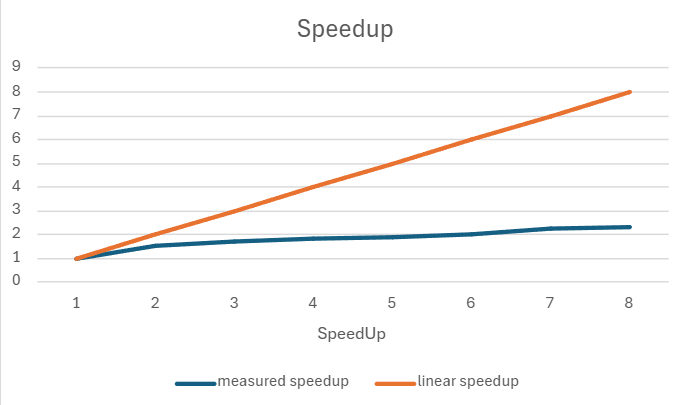
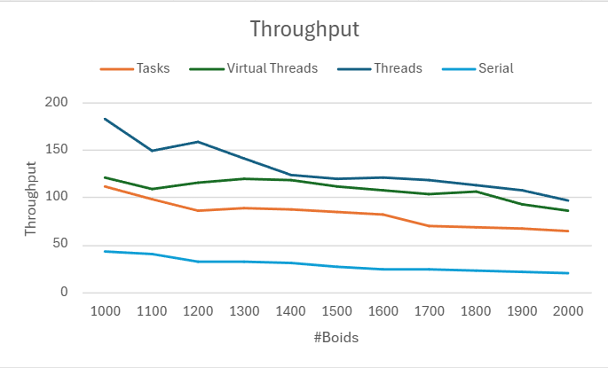

# Report Assingment 1 - PCD

- MVC con notifies (la gui si blocca sul lock però)
- RWLock implementation (solo per le performance)
- PN: i token sono i thread, le piazze sono gli stati

- Formula speedup e throughput (1 boid = 1 operazione)
- vel1 +1: perché deve avere il tempo di aggiornare la gui prima che scrivano
- pos + 1: ha bisogno di sapere che hanno finito di scrivere per aggiornare la gui

- Join Issue
- Executor: spammare reset lo rallenta molto, perché?


### Open Design Issue: Workers Join 
La join viene fatta per aspettare che tutti i thread escano effettivamente da ciclo prima di settare di nuovo il reset
button come unpressed. Così sono sicuro che tutti i thread facciano in tempo a vederlo.
Però rischio di rimanere bloccato se alcuni sono bloccati sulla prima barriera.

Quando faccio stop, non è detto che tutti stiano nel ciclo esterno, alcuni potrebbero entrare prima che lo stop venga
segnalato, e gli altri non possono più entrare. Metà è dentro e metà è fuori. Quelli dentro si bloccano sulla barriera, quelli fuori aspettano di ripartire. 
Appena viene premuto resume, gli altri thread entrano e tutto procede normalmente. Se viene premuto reset, i thread rimasti fuori terminano, quelli rimasti dentro no.

Il controllo di tutti i thread dovrebbe essere atomico rispetto al cambiamento della flag, anche solo per la stop.
Non posso usare un counter perché se sono nel loop esterno un thread potrebbe fare molti controlli prima degli altri.
Però se non sono in stop, posso contare gli accessi e quando raggiungo il numero di thread, allora permetto le write.

Però come bloccare le write? Dovrei fare una classe AtomicWorkerGroup che si tiene lo stato running/notrunning ed il numero di thread, e viene fatto notify ad ogni controllo.
Quando è in stato running il counter aumenta di generazione ogni volta che sono entrati tutti.
La write può essere fatta solo quando sono tutti dentro. Ma potrebbero fare in tempo ad uscire mentre segnali la write, e potrei non fare in tempo a bloccare l'accesso al lock.
Inoltre sto spostando il problema dell'accesso da una classe all'altra.

Se ti riduci ad usare interrupt vuol dire che non c'è un buon design. Non c'è un modo migliore?
Però ha senso fare interrupt quando viene premuto reset. Hai già una flag ma non basta. 
Dovrebbero controllare la flag anche prima di mettersi in attesa sulla barriera.
Ma anche in quel caso, alcuni potrebbero controllarla pirma di altri, o essere già in attesa.
Basterebbe un singolo interrupt per poterli joinare tutti.

Però dovresti sporcare il codice mettendo un if prima di ogni barriera.
Forse basterebbe una flag iteration started in OR sul ciclo interno.
Però questa nuova flag non avrebbe gli stessi problemi?

## Analisi
Il problema principale da affrontare era la gestione delle letture e scritture di ogni boid della lista condivisa.
Infatti ogni boid per aggiornare la propria velocità deve fare riferimento ai boid vicini, di conseguenza deve leggere
il loro stato. Senza nessun tipo di sincronizzazione, c'è il rischio che un thread/task vada a leggere la velocità di un
boid vicino mentre un altro thread/task la sta modificando.
Ogni versione era propensa a tecniche di parallelizzazione diverse, ma la sincronizzazione era simile.

## Design
In tutte le versioni, per sincronizzare le letture e scritture dei boid, sono state individuate delle fasi separate di
lettura e scrittura dei boid. Prima di iniziare una nuova fase è necessario che tutti i thread/task abbiano terminato la
fase precedente.
Pr ogni boid le fasi sono:

1. Lettura e calcolo della velocità
2. Scrittura della nuova velocità
3. Calcolo e scrittura della nuova posizione
4. Lettura ed aggiornamento della GUI

L'aggiornamento della GUI avviene solo in una fase in cui i boid non vengono modificati. Per questo motivo ho usato il
metodo SwingUtils.invokeAndWait() per aggiornare la GUI in modo sincrono, onde evitare che i thread/task possano
modificare i boid mentre la GUI li sta ancora leggendo.

Lo stato di esecuzione della simulazione è incapsulato dentro al controller tramite un oggetto monitor `Flag`. Quando
dei bottoni vengono premuti, la view invoca dei metodi `notify` sul controller per notificare l'evento, di conseguenza
il controllr modifico lo stato della Flag.
La Fla viene usate dai worker ad ogni frame per controllare se continuare o meno l'esecuzione. Nello specifico, i
diversi bottoni hanno questo effetto:

* `Suspend/Resume`: modificano la flag, i worker non possono iniziare una nuova iterazione finché il bottone non viene
  premuto nuovamente.
* `Reset`: quando viene premuto, i worker terminano ed il main ne crea di nuovi, con una nuova lista di boid aggiornata
  alla nuova dimensione. Il tasto reset può essere premuto solo mentre la simulazione è ferma.
<br/><br/>

### Reti di Petri 
Le piazze rappresentano gli stati che attraversano i worker, mentre i token rappresentano i worker.
Queste reti prendono in considerazione il caso di 3 worker ed il main (4 token totali).

<div style="text-align: center;">

<br/><br/>


<br/>
<br/>

</div>


## Versione 1: Platform Threads

In questa versione sono stati creati `N` thread (N = numero di core disponibili), ognuno dei quali si occupa di un
sottoinsieme di boid.
Sono state usate diverse barriere cicliche per mantenere i thread sincronizzati nelle varie fasi di calcolo/lettura e
scrittura dei boid.
La GUI viene modificata dopo che la velocità e la posizione di tutti i boid sono state aggiornate al nuovo istante di
tempo. Finché l'aggiornamento della GUI non è terminato, i thread/task non possono procedere a scrivere i nuovi valori
di posizione/velocità.

Le barriere utilizzato sono:

1. Barriera per il calcolo della velocità
2. Barriera per l'aggiornamento della velocità
3. Barriere per l'aggiornamento della posizione
4. Barriera per l'aggiornamento della GUI

I thread vengono ricreati solo alla pressione del tasto reset, quando viene premuto il tast suspend i thread non possono
eseguire nuove iterazioni a causa della Flag.

`MyCyclicBarrier`: utilizzando un lock è stata costruita una sezione critica nel metodo await, che ferma il thread in
attesa nel caso in cui il numero di thread già attesa non è sufficiente a rompere la barriera. Il thread che rompe la
barriera prima la resetta e poi sveglia tutti i thread in attesa.
La condizione sul while utilizza una variabile `generation` e non il `counter`, altrimenti ci sarebbe il rischio che un
thread controlli la condizione sul counter quando è già stato resettato.

`JPF Model Checking`: è stato realizzato un modello semplificato del codice, rimuovendo la GUI, semplificando il calcolo
della velcoità e rimuovendo l'utilizzo del random nell'inizializzazione dei boid. Non sono stati rilevate corse critiche
o deadlock.

<br/>

```

```

## Versione 2: Executor

In questa versione sono stati creati delle classi `Task` diverse per le fasi di lettura/calcolo ed aggiornamento dei
boid.
In ogni fase, viene creato un task per ogni boid, e poi invocati in parallelo tramite un `ExecutorService` di tipo
`FixedThreadPool`.
Si attende il completamento di ogni task aspettando sull'oggetto `Future` corrispondente.
Quando tutti i task di una fase sono terminati, si può passare alla fase successiva. Terminate le fasi, si aggiorna la
GUI e si ripete il ciclo.

Tipologie di Task create:

1. Task per il calcolo della velocità
2. Task per l'aggiornamento della velocità
3. Task per l'aggiornamento della posizione

I task vengono interrotti e ricreati solo alla pressione del tasto reset, altrimenti vengono invocati ad ogni
iterazione.
Alla pressione del tasto suspend, il main non esegue più il codice in cui i task vengono invocati.
Alla pressione del tasto reset, vengono creati dei nuovi task in base alla nuova dimensione della lista di boid.

<br/>

## Versione 3: Virtual Threads

Dato che i virtual thread sono molto leggeri e ci permettono di superare il limite di thread fisici del sistema, in
questa versione è stato creato un virtual thread per ogni boid, che si occupa dei calcoli e degli aggiornamenti
corrispondenti.
Anche in questo caso vengono utilizzate delle barriere cicliche per sincronizzare i thread e separare le fasi di calcolo
da quelle di aggiornamento.

Le barriere utilizzato sono:

1. Barriera per il calcolo della velocità
2. Barriera per l'aggiornamento della velocità
3. Barriere per l'aggiornamento della posizione
4. Barriera per l'aggiornamento della GUI

I thread vengono ricreati solo alla pressione del tasto reset, quando viene premuto il tast suspend i thread non possono
eseguire nuove iterazioni a causa della Flag.

<br/>

## Misurazioni delle Performance

Sono state realizzate delle versioni senza GUI per misurare le performance delle varie versioni evitando la `sleep` del
main tra i vari frame. In questo modo il codice poteva proseguire a briglia sciolta senza limiti di `framerate` ed
evitare l'overhead della GUI.
Tutte le versioni sono state testate in condizioni simili, con 1000 boid e 1000 iterazioni. Nel conteggio è stato
incluso anche il tempo di creazione dei thread/task.

Misurazioni: 1000 boids, 1000 iterazioni, senza GUI

0. Execution time: 74986 ms (1 thread)
1. Execution time: 8592 ms (8 thread)
2. Execution time: 14101 ms (executor)
3. Execution time: 15163 ms (virtual thread)
<br/><br/>

<div style="text-align: center;">

<br/><br/>


</div>
